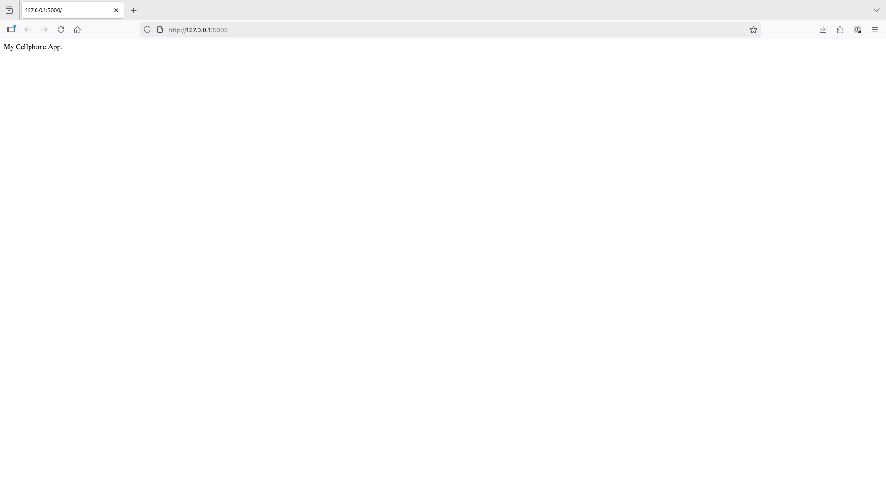

 # My Cellphone App / Mobile App Simulator 

## Table of contents: 

- [Introduction](#introduction)
- [Prerequisites](#prerequisites)
- [Navigate to the Application Directory](#navigate-to-the-application-directory)
- [Install Flask](#install-flask)
- [Code Explanation](#code-explanation)
- [Run the Application](#run-the-application)
- [Final Objective](#final-objective)
- [Next Steps](#next-steps)

---

## Introduction: 

In this first part of the project I’ll show you how I run a simple server Application using Python and flask 

---

## Pre-requisites: 

Ensure you have Python installed on your system. You can verify this by running:

```bash
python3 --version
````
---

## Navigate to the Application Directory

Navigate to the `Part1` directory where the application files are located:

```bash
cd  Final Project /My Cellphone App/Part 1
```
---

## Install Flask

Flask is a lightweight WSGI web application framework in Python. To install Flask, use pip:

```bash
pip3 install Flask
```
---

## Code Explanation: 

The code creates a flask application that simulates the status of 3 different applications in a cellphone with random changes every 5 minutes. 

1. It displays the metrics on port 8000 for Prometheus on /metrics. 

2. Uses Gauge to indicate if an Application is up or down. 

3. It records the numbers of errors each time an application fails

4. We can observe the status on http://localhost:5000 and the metrics on http://localhost:8000/metrics.

---

### Code Breakdown 

```python
from flask import Flask
from prometheus_client import start_http_server, Gauge # pyright: ignore[reportMissingImports]
import random
import time
import threading

app = Flask(__name__)
```

* **Importing Flask**: This imports the Flask class from the `flask` library.

* **Importing prometheus_client**:  This imports functions from prometheus_client and this is used to display metrics in prometheus format

* **start_http_server**: started a HTTP server that displays the metrics on /metrics.

* **Gauge**: it’s a kind of metric that can go up and down, for example the state of an app

* **Initializing the App**: `app = Flask(__name__)` creates an instance of the Flask application.

The comment # pyright: ignore[reportMissingImports] it’s to avoid warnings since I’m using VS Code with Python 

```python
# Simulated apps
apps = {
    "WhatsApp": True,
    "Instagram": True,
    "Gmail": True
```

* **WhatsApp,Instagram &  Gmail**: These are the mobile applications the app is going to simulate 

True indicates the app is working as expected. 

* **app status**: indicates if the app is up (1) or down (0)

* **app errors**: counts the amount of times the app fails 

```python
app_status_gauge = Gauge('app_status', 'Status of each app (1=active, 0=inactive)', ['app'])
app_error_gauge = Gauge('app_errors', 'Number of errors per app', ['app'])
```

* **def simulate_app_status**:

This function simulares the state of the apps every 5 seconds. 

It uses random.choice to decide if an app is up or down ( with a higher probability of being up)

Update prometheus metrics. 

```python
def simulate_app_status():
    while True:
        for app_name in apps:
            status = random.choice([True, True, True, False])
            apps[app_name] = status
            app_status_gauge.labels(app=app_name).set(1 if status else 0)
            if not status:
                error_counts[app_name] += 1
                app_error_gauge.labels(app=app_name).set(error_counts[app_name])
        time.sleep(5)
```


---

## Run the Application

To run the Flask application, execute the following command from the Part 1 directory:

python app.py

Once the application is running, open your browser and visit the following URL: 

* http://127.0.0.1:5000 (localhost)

You should see the following message:

My Cellphone App. 

---

## Final Objective

At the end of this part, you should accomplish the following: 



---

## Next Steps 

Now that we’ve successfully run my first Flask application:

* Proceed to [Part2](../Part2/), where I’ll show you how to package this Python app into a Docker container.